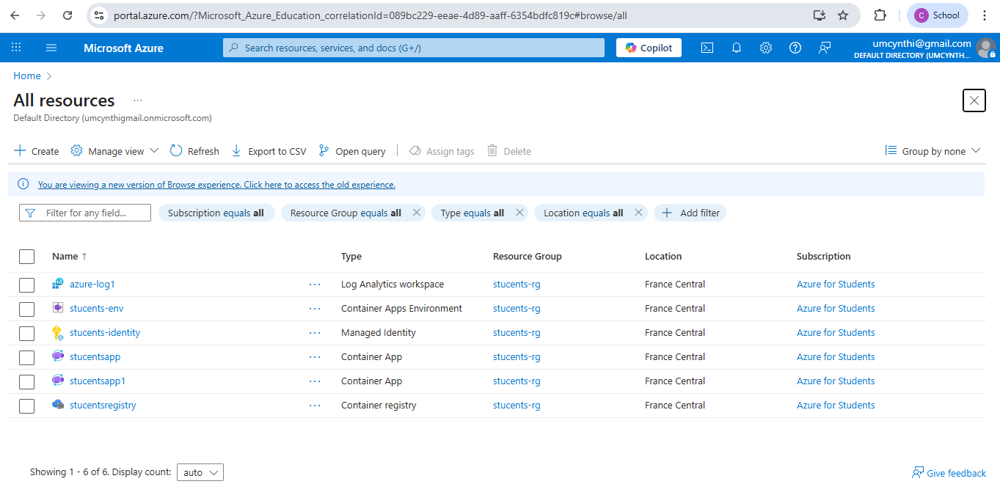

### PUBLIC URL

stucentsapp1--0000003.delightfulsand-0c9a81e8.francecentral.azurecontainerapps.io

---

# Phase Reflection – IaC and Deployment

## Challenges Faced with Infrastructure as Code (IaC)

1. **Complex Azure IAM Setup**  
   Assigning the correct roles and access between Azure Container Registry (ACR), Container Apps, and Identity Services was more complex than expected. Many errors like `RoleAssignmentExists` or missing pull permissions required deep debugging.

2. **State Conflicts**  
   Terraform often failed due to pre-existing resources like resource groups or log analytics workspaces. Learning how to `terraform import` existing Azure resources was necessary to avoid duplicate resource errors.

3. **Quota & Region Limitations**  
   Azure limited our subscription to only 1 Container App Environment. Hitting that limit blocked progress until unnecessary environments were manually deleted.

4. **Networking & Firewall Restrictions**  
   Terraform provider registry connectivity errors (`context deadline exceeded`) and Docker port binding conflicts caused repeated deployment failures, especially in shared environments.

---

##  Manual vs IaC

- **Manual Deployment**:  
  While initially faster via Azure Portal, manual deployment proved hard to reproduce or document. It was also error-prone and didn’t scale when the team needed to redeploy or update.

- **IaC (Terraform)**:  
  Although difficult at first, Terraform gave more control, traceability, and versioning. Once working, it became the preferred method for consistent and clean deployments.

---

##  Conclusion

This phase helped build a solid understanding of how modern cloud apps are deployed using containers and Terraform. It also emphasized the importance of debugging skills, cloud limits, and secure environment configurations.

### AZURE RESOURCES SCREENSHOT

### Peer review Link
https://github.com/Idiane05/habit-tracker/pull/7#pullrequestreview-3052952656
