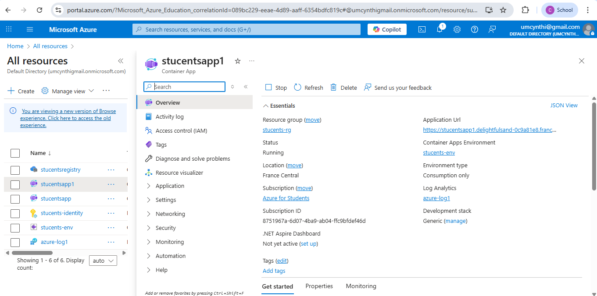
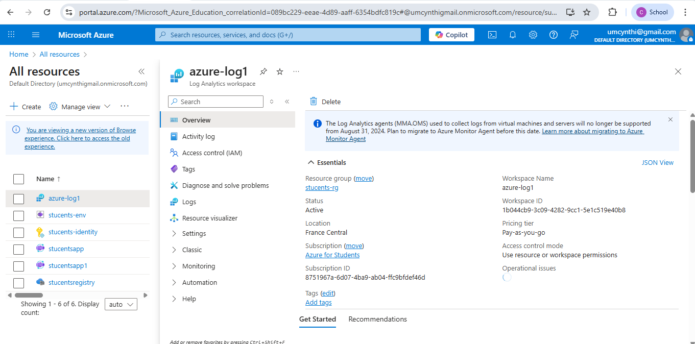
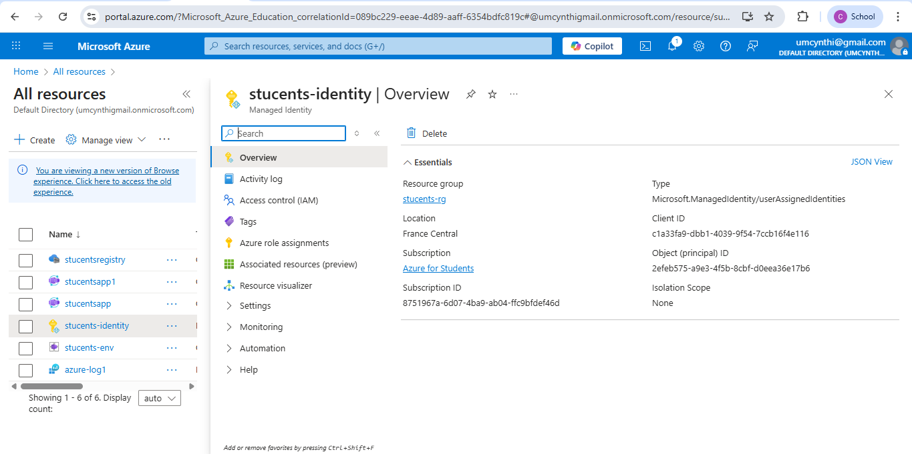
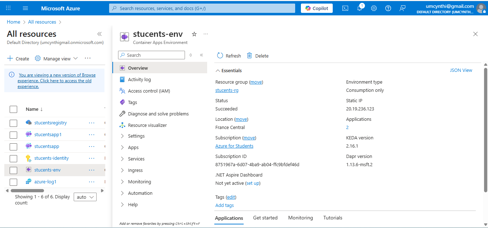
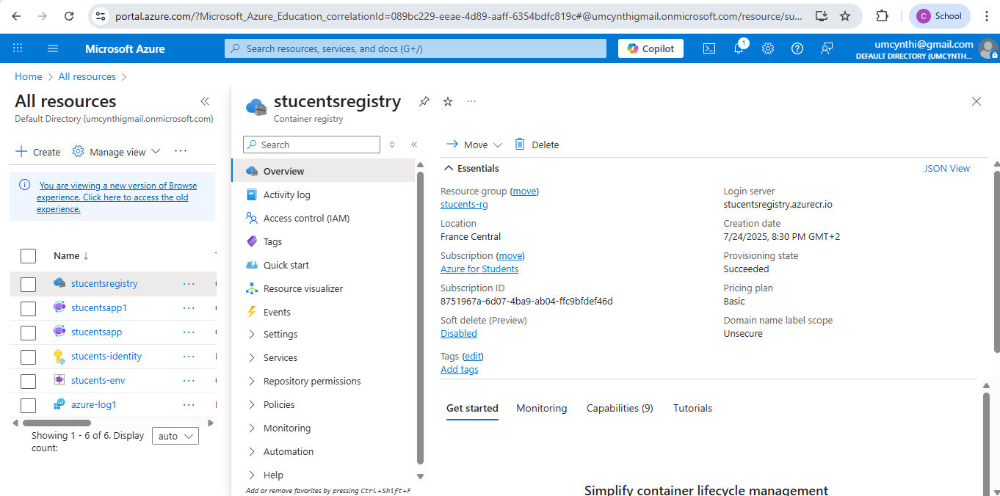

### PUBLIC URL

stucentsapp1--0000003.delightfulsand-0c9a81e8.francecentral.azurecontainerapps.io

---

## Reflection on Challenges

### Infrastructure as Code (IaC)

Using Terraform to provision cloud resources was powerful but had a learning curve:

- **Challenge**: Writing correct syntax and referencing dependencies in the right order.
- **Solution**: Carefully reading error messages and using `terraform plan` before `apply` helped me understand what will change.

### Manual Deployment Process

Initially I tried manual deployment via Azure Portal, but:

- **Challenge**: Manual steps were slower and error-prone.
- **IaC Advantage**: With Terraform, I could version and repeat deployments quickly and track every change in Git.

### Overall Takeaway

Combining Docker, Terraform, and Azure makes deployment repeatable and scalable. While troubleshooting required patience, this project gave me real-world DevOps skills and cloud confidence.

---

### AZURE RESOURCES SCREENSHOT

### Peer review Link
https://github.com/Idiane05/habit-tracker/pull/7#pullrequestreview-3052952656

**Project:** StuCents App – Student Expense Tracker
